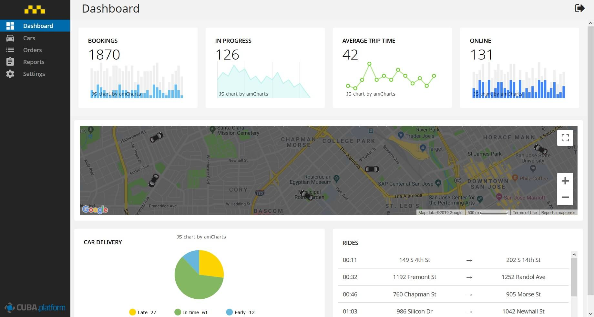
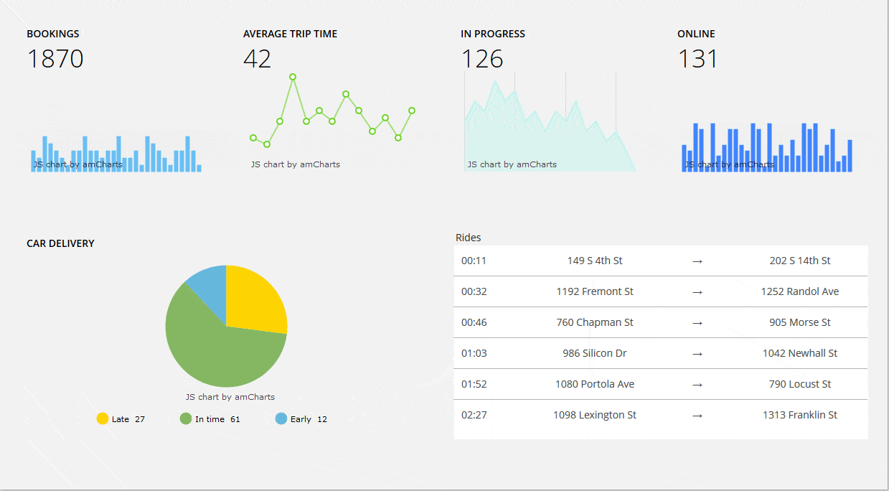

# Dashboard CUBA Add-on Demo Application

This demo application demonstrates the usage of 
[Dashboards](https://github.com/cuba-platform/dashboard-addon) CUBA Add-on.

## Responsive layout

This sample uses CSS based responsive layout for dashboard:

## Usage

Open the project in CUBA Studio and click "Run" button next to "CUBA Application"
run/debug configuration on the main toolbar.
The application will start at [http://localhost:8080/dashboards](http://localhost:8080/dashboards).

Use `demo` as both login and password to access the application.

## Issues

Please use https://www.cuba-platform.com/discuss for discussion, support,
and reporting problems coressponding to this sample.